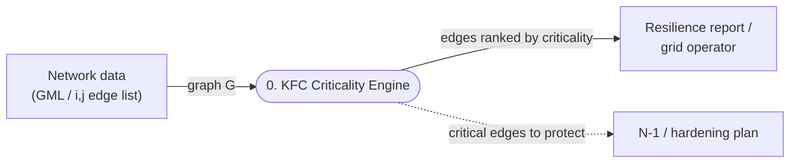
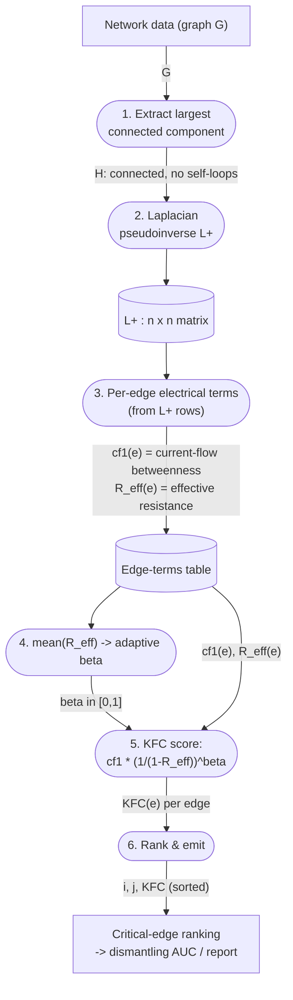

# Kirchhoff Flow Criticality (KFC) — Data Flow Diagram & Explanation

**What it is.** KFC is an edge-criticality algorithm: given a network, it scores every
edge (transmission line) by how critical it is to keeping the network connected, so the
most important lines can be **protected, made redundant, and covered by N-1 / N-k
contingency planning**. It fuses two electrical signals — *current-flow throughput* and
*effective-resistance irreplaceability* — and auto-tunes the fusion to the graph's
density. It generalises fast-exact current-flow betweenness (`CFEdge`): when the graph is
tree-like the fusion turns off and KFC reduces exactly to `CFEdge`.

---

## 1. Data Flow Diagram

### Level 0 — Context



### Level 1 — Inside the engine



**Legend (DFD notation):** rectangles = external entities/data; stadiums = processes;
cylinders = data stores; arrows = labelled data flows.

---

## 2. What each process does

| # | Process | Input → Output | Why |
|---|---------|----------------|-----|
| 1 | **Extract LCC** | `G` → `H` (largest connected component, self-loops stripped) | The electrical model needs a single connected graph; isolated stubs/parallel components are removed. |
| 2 | **Laplacian pseudoinverse** | `H` → `L⁺` (n×n) | `L = D − A` is the graph Laplacian; its Moore–Penrose pseudoinverse `L⁺` encodes *all* pairwise electrical relationships. Computed once, dense — instant for a few-hundred-node grid, **no scipy needed** (`np.linalg.pinv`). |
| 3 | **Per-edge terms** | `L⁺` → `cf1(e)`, `R_eff(e)` for every edge | Two numbers per edge, both read straight off `L⁺` rows (details below). |
| 4 | **Adaptive β** | edge terms → `β ∈ [0,1]` | `β = clip(1 − mean(R_eff)/0.15, 0, 1)`. Tree-like graphs (high mean R_eff) → β=0; dense graphs (low mean R_eff) → β→1. This one scalar decides how much irreplaceability weighting to apply. |
| 5 | **KFC score** | `cf1, R_eff, β` → `KFC(e)` | `KFC(e) = cf1(e) · (1 / (1 − R_eff(e)))^β`. The fusion. |
| 6 | **Rank & emit** | scores → sorted `i, j, KFC` | Higher = more critical. Feeds the dismantling curve, the report, and the protection list. |

### The two per-edge terms (Process 3)

For edge `e = (u,v)`, let `d = L⁺[u,:] − L⁺[v,:]` (a length-n vector).

- **`cf1(e)` — current-flow (electrical) betweenness = throughput.** The total current
  that routes through `e` when unit current is injected across every source–sink pair.
  It equals `Σ_{s<t} |d[s] − d[t]| / n_pairs`, which collapses to a **sorted-vector
  identity** — `Σ_i (2i − (n−1))·sort(d)_i / n_pairs` — so it costs `O(N log N)` per edge
  instead of the naive `O(N²)`. High for edges that carry lots of flow (central corridors,
  inter-community links).
- **`R_eff(e)` — effective resistance = irreplaceability.** `R_eff = L⁺[u,u] + L⁺[v,v] −
  2·L⁺[u,v]` — the resistance between `u` and `v` through the *whole* network. A **bridge
  has R_eff = 1** (no parallel path); an edge with many redundant paths has R_eff → 0.

**Why multiply them (the Kirchhoff-index grounding).** By the Sherman–Morrison identity,
deleting a non-bridge edge raises the network's *Kirchhoff index* (total resistance-distance,
`Kf = n·trace(L⁺)`) by `‖d‖² / (1 − R_eff(e))`. So `1/(1−R_eff)` is exactly the
sensitivity of overall connectivity to losing that edge — throughput amplified by
irreplaceability. `β` tempers it because on tree-like grids almost every edge has high
R_eff and full amplification over-fires (it wrecks accuracy on sparse grids), so β backs
off to 0 there and KFC = `cf1` = `CFEdge`.

---

## 3. Worked example (all numbers computed, not invented)

Take a tiny network: **two triangles joined by a single bridge** — triangle A `{0,1,2}`,
triangle B `{3,4,5}`, bridge `(2,3)`. 6 nodes, 7 edges.

```
   0            4
   |\          /|
   | 2 ------ 3 |     <- (2,3) is the only bridge
   |/          \|
   1            5
```

Running the algorithm: `mean(R_eff) = 0.714` → **β = 0** (sparse/tree-like ⇒ no
amplification ⇒ KFC = CFEdge). Per-edge output, sorted by criticality:

| edge | cf1 (throughput) | R_eff | **KFC** | reading |
|------|------|------|------|---------|
| **(2,3)** | 0.600 | **1.000** | **0.600** | the bridge — carries *all* cross-cluster flow; its loss splits the network |
| (1,2) | 0.289 | 0.667 | 0.289 | edges touching a bridge endpoint — funnel flow into the bridge |
| (0,2) | 0.289 | 0.667 | 0.289 | " |
| (3,4) | 0.289 | 0.667 | 0.289 | " |
| (3,5) | 0.289 | 0.667 | 0.289 | " |
| (0,1) | 0.222 | 0.667 | 0.222 | the "far" triangle edges — most redundant, least critical |
| (4,5) | 0.222 | 0.667 | 0.222 | " |

The bridge is ranked #1 with **2× the score** of any other edge — the algorithm correctly
identifies the single line whose loss would fragment the grid. Removing it in a dismantling
simulation drops the giant component from 6 nodes to 3 immediately.

**When β turns on.** On dense graphs the fusion activates: complete graph K16 → β=0.17,
K30 → β=0.56, and the real Jazz network (198 nodes, 2742 edges, mean R_eff 0.072) → β=0.52,
where KFC edges ahead of plain current-flow. On sparse infrastructure like the Tokyo grid
(mean R_eff 0.82) β stays 0 and KFC = the fast, best-performing current-flow method.

---

## 4. How it helps — grid resilience use cases

The ranking answers *"which lines and substations must we protect first?"*. Concretely:

- **N-1 / N-k contingency prioritisation.** The top-ranked edges are the ones whose single
  failure most degrades connectivity — exactly the contingencies to simulate and defend.
- **Hardening budget allocation.** Limited money to weatherproof / physically secure lines
  → spend it on the highest-KFC corridors, not uniformly.
- **Where to add redundancy.** A high-KFC *bridge* (R_eff = 1) is a single point of failure;
  the fix is to build a parallel path, which drops its R_eff and its KFC — you can re-run and
  see the criticality fall, quantifying the redundancy's benefit.
- **Fast enough for interactive / repeated use.** One Laplacian solve + `O(E·N)`; on the
  Tokyo grid it runs in ~15 ms, versus seconds-to-minutes for the min-cut and
  subset-betweenness methods — so operators can re-score after every topology change.

**On the real Tokyo grid**, the same pipeline (`run_resilience_analysis.py`) surfaces the
Tadami and Shin-Koga 500 kV trunks as the top load-bearing corridors and the Shin-Niigata
500 kV trunk as the top structural bottleneck — the lines a resilience plan should protect
first.

---

*Implementation:* `src/utils/prototype_criticality.py` (KFC) and
`src/utils/resilience_utils.py` (`current_flow_edge_betweenness`, `rank_effective_resistance`).
Benchmark & verdict: `results_comparison/methodology_comparison.md`,
`results_comparison/prototype_kfc_findings.md`.
